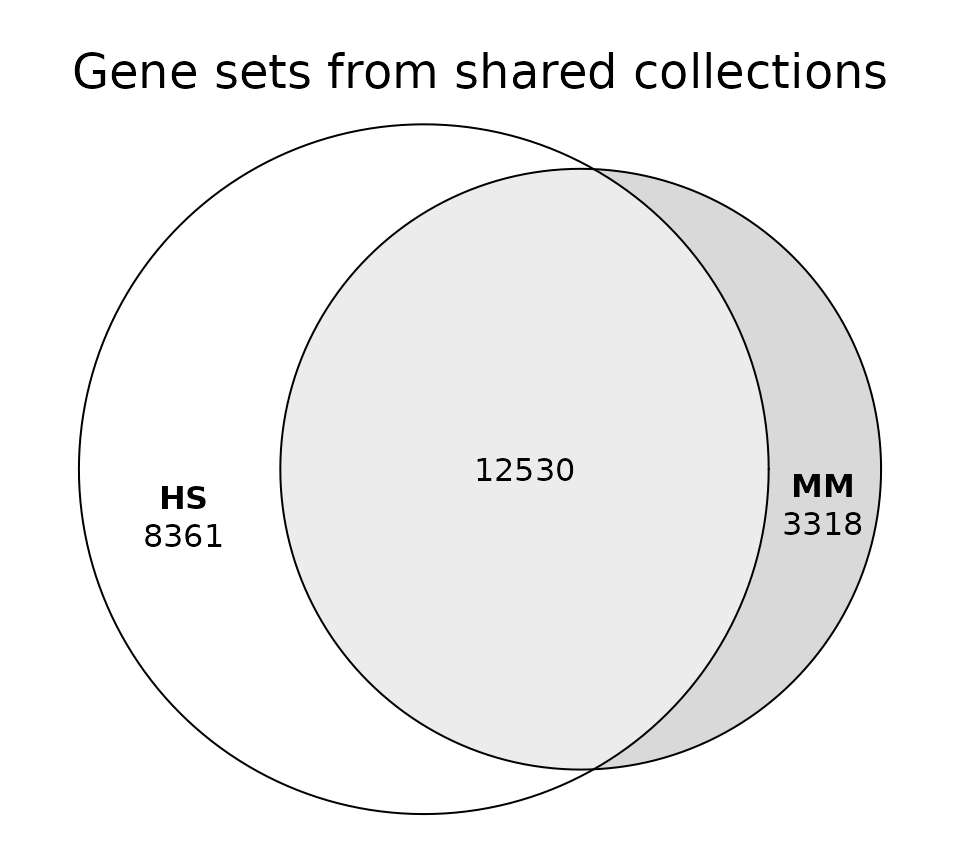
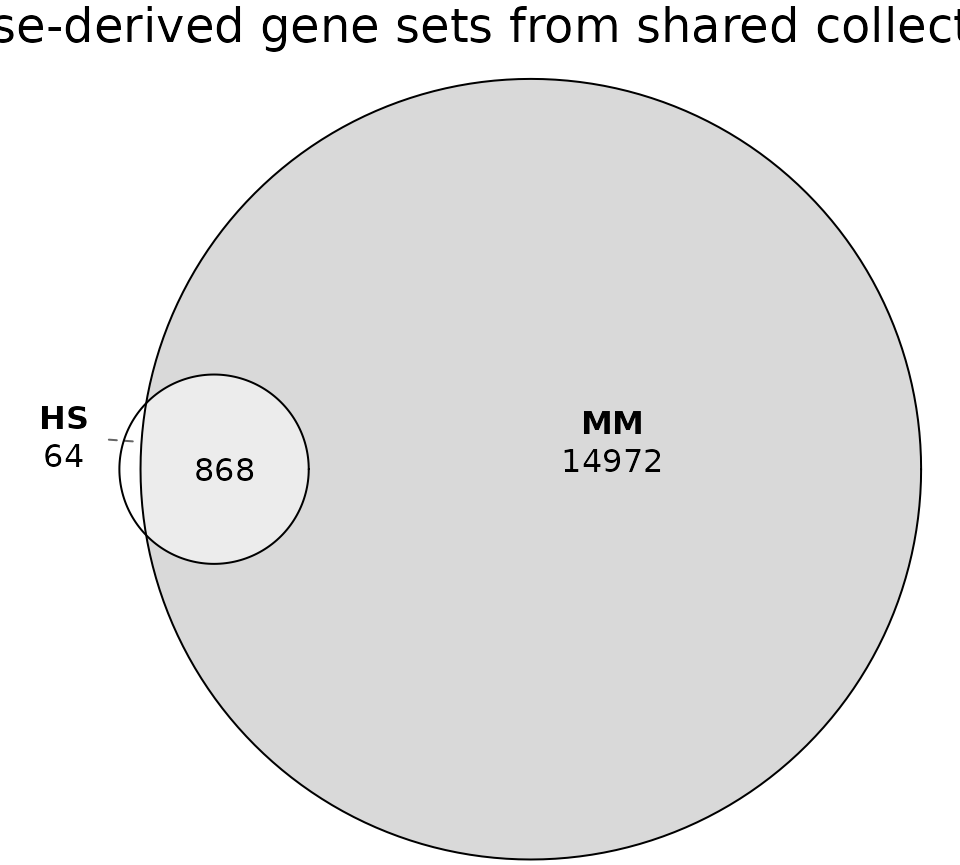
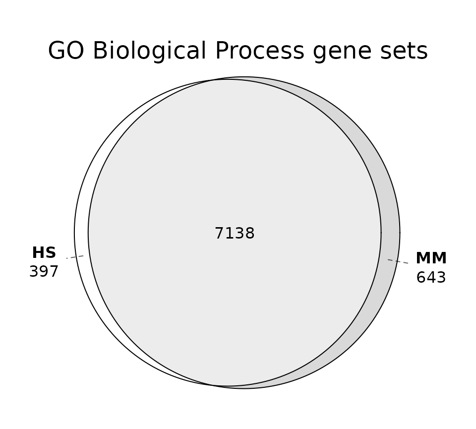
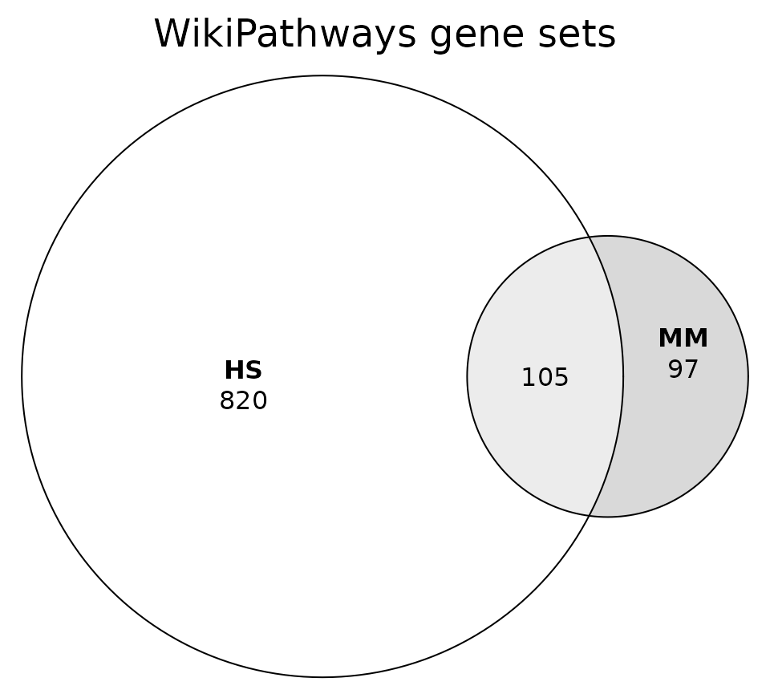
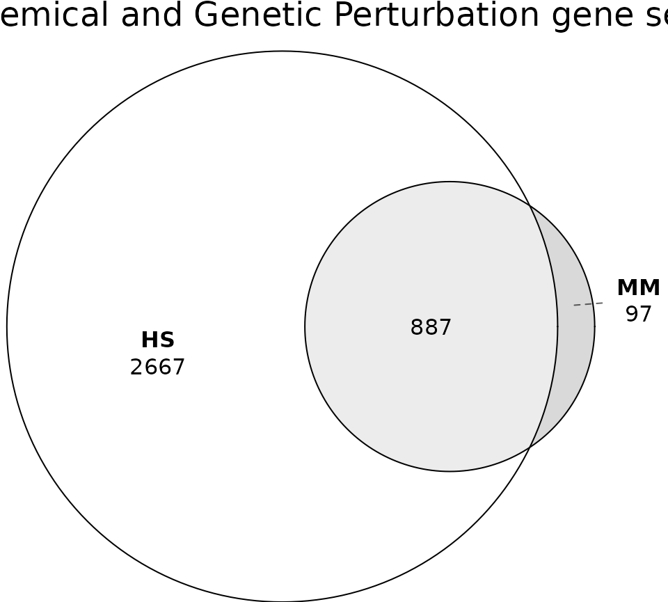
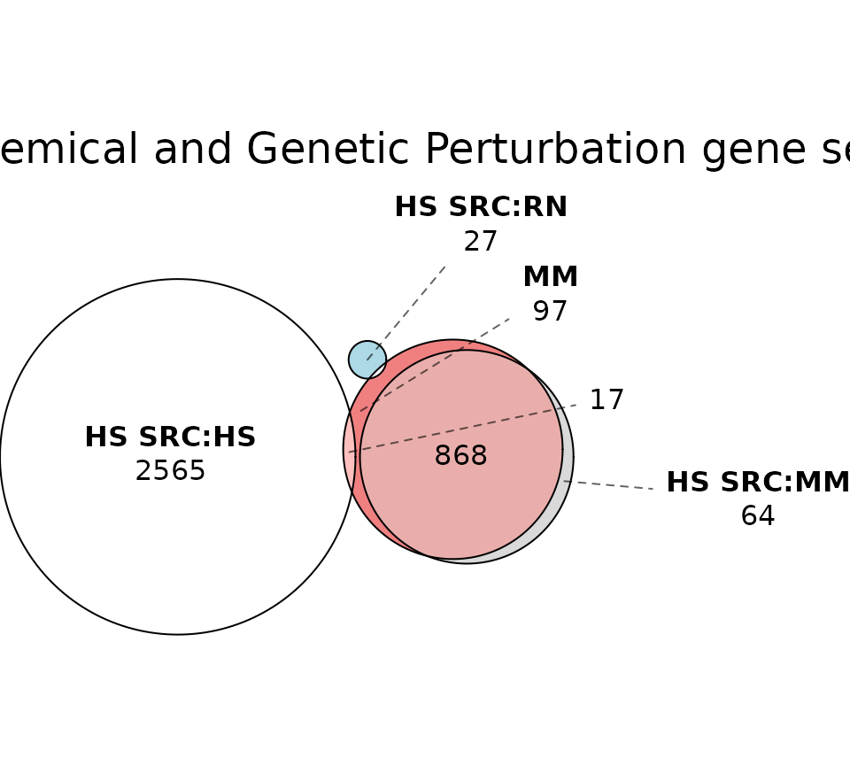
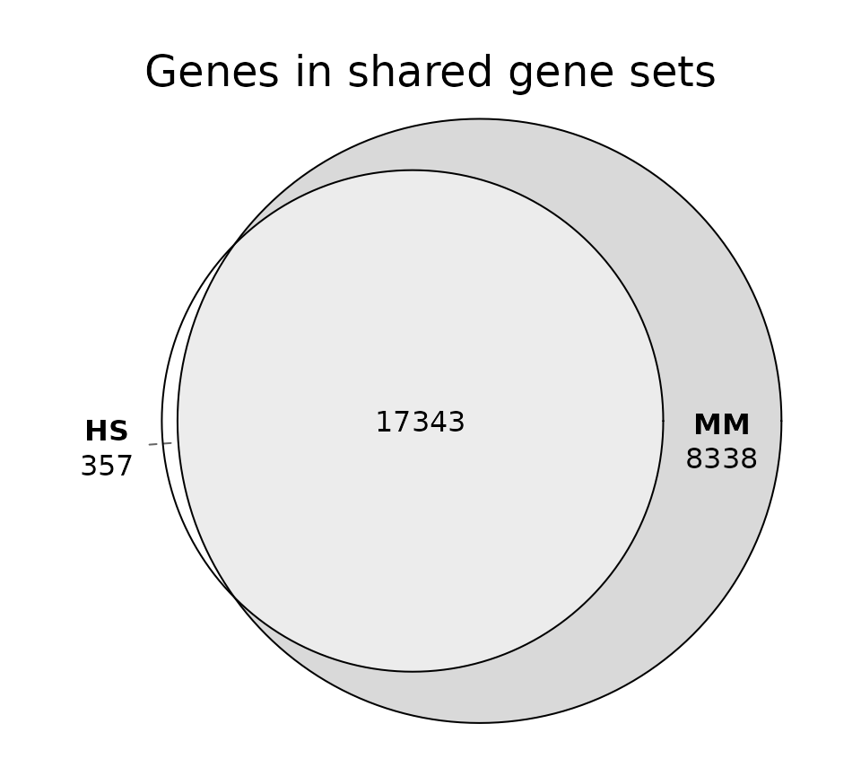
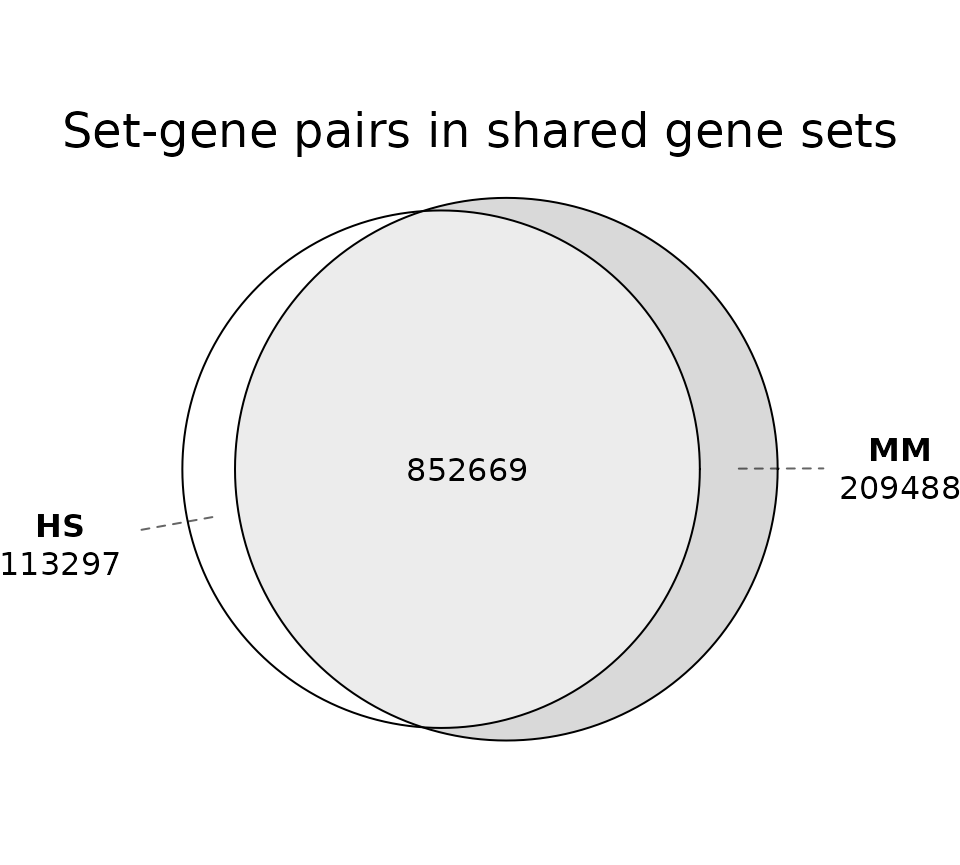
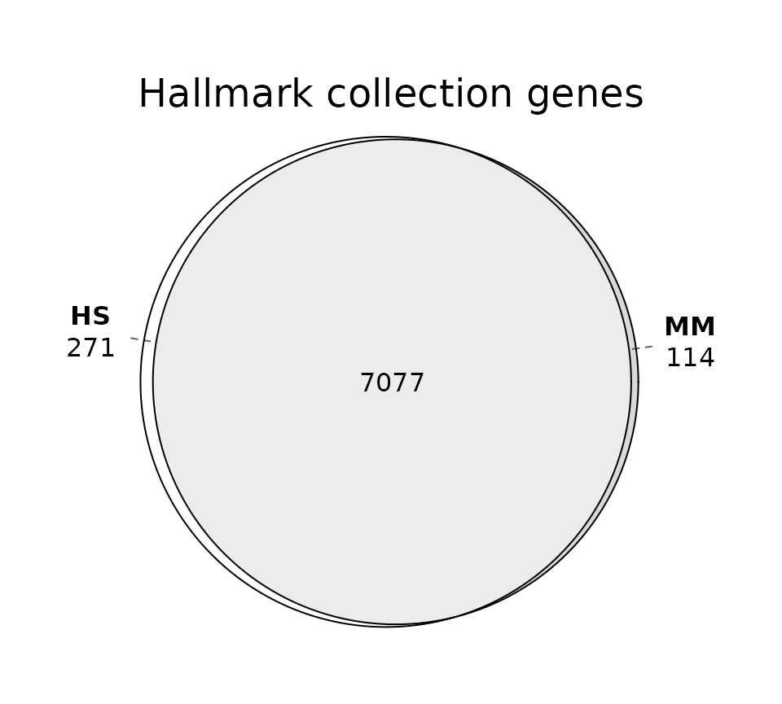
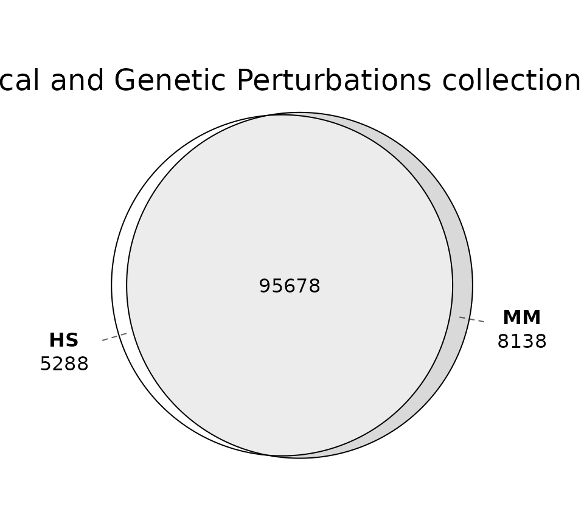

# Human and mouse MSigDB databases

## Introduction

The MSigDB resource has historically been tailored to the analysis of
human-specific datasets, with gene sets exclusively aligned to the human
genome. One of the initial goals of msigdbr was to simplify conversion
of those human gene sets to other species, most notably mouse.

Recent versions of MSigDB are split into human and mouse datasets. As
described in the initial [release
notes](https://docs.gsea-msigdb.org/#MSigDB/Release_Notes/MSigDB_2022.1.Hs/):

> MSigDB is now split into two major divisions; a series of gene set
> collections that are provided in the namespace of human gene symbols,
> and a series of gene set collections that are provided in the
> namespace of mouse gene symbols. As such the versioning convention of
> MSigDB has changed to adopt the format Year.Release.Species.

The corresponding publication ([Castanza et al,
2023](https://doi.org/10.1038/s41592-023-02014-7)) provided additional
context:

> While ortholog mapping is useful, some degree of uncertainty exists
> when discriminating between orthologs and paralogs, and even
> orthologous genes in human and mouse can have different functions. The
> inclusion of all genes — that is, not excluding species-specific genes
> — may be key to gaining mechanistic insights and understanding
> species-specific biology. Therefore, we invested substantial effort to
> support analysis of mouse data through the release of Mouse MSigDB,
> which consists of gene sets curated directly from mouse-centric
> databases and datasets and specified in native mouse gene identifiers.
> These sets can be used without the need for ortholog mapping. … By
> offering both support for native analysis of mouse data and support
> for mapping mouse data to use with human gene sets and human data to
> use with mouse-native sets, the new MSigDB enhancements represent a
> significant step forward in the potential translational impact of GSEA
> results and put the enrichment analysis of mouse and human data on
> equal footing.

The goal of this vignette is to compare the human and mouse databases to
better understand their similarities and differences.

## Load data

Load the relevant packages.

``` r

library(msigdbr)
library(dplyr)
library(eulerr)
```

Retrieve human and mouse databases. Use mouse orthologs for the human
database to make the genes comparable.

``` r

hs <- msigdbr(db_species = "hs", species = "mouse")
mm <- msigdbr(db_species = "mm", species = "mouse")
```

All the results below are specific to this release of MSigDB.

``` r

unique(hs$db_version)
#> [1] "2026.1.Hs"
unique(mm$db_version)
#> [1] "2026.1.Mm"
```

Remove the positional gene sets that correspond to chromosome
cytogenetic bands. Including those in any comparisons would not be
meaningful.

``` r

hs <- filter(hs, gs_collection_name != "Positional")
mm <- filter(mm, gs_collection_name != "Positional")
```

Generate a collections data frame (ignore genes and gene sets).

``` r

collections_hs <- distinct(hs, gs_collection, gs_subcollection, gs_collection_name)
collections_mm <- distinct(mm, gs_collection, gs_subcollection, gs_collection_name)
```

Generate a gene sets data frame (ignore genes).

``` r

genesets_hs <- distinct(hs, gs_collection, gs_subcollection, gs_collection_name, gs_name, gs_source_species)
genesets_mm <- distinct(mm, gs_collection, gs_subcollection, gs_collection_name, gs_name, gs_source_species)
```

## Collections

Check how many collections are present in each database.

``` r

message("Number of HS collections: ", nrow(collections_hs))
#> Number of HS collections: 25
message("Number of MM collections: ", nrow(collections_mm))
#> Number of MM collections: 13
```

**The human database includes more collections than the mouse
database.**

Check which collections are present in each database.

``` r

arrange(collections_hs, gs_collection, gs_subcollection)
#> # A tibble: 25 × 3
#>    gs_collection gs_subcollection  gs_collection_name                    
#>    <chr>         <chr>             <chr>                                 
#>  1 C2            "CGP"             "Chemical and Genetic Perturbations"  
#>  2 C2            "CP"              "Canonical Pathways"                  
#>  3 C2            "CP:BIOCARTA"     "BioCarta Pathways"                   
#>  4 C2            "CP:KEGG_LEGACY"  "KEGG Legacy Pathways"                
#>  5 C2            "CP:KEGG_MEDICUS" "KEGG Medicus Pathways"               
#>  6 C2            "CP:PID"          "PID Pathways"                        
#>  7 C2            "CP:REACTOME"     "Reactome Pathways"                   
#>  8 C2            "CP:WIKIPATHWAYS" "WikiPathways"                        
#>  9 C3            "MIR:MIRDB"       "miRDB"                               
#> 10 C3            "MIR:MIR_LEGACY"  "MIR_Legacy"                          
#> 11 C3            "TFT:GTRD"        "GTRD"                                
#> 12 C3            "TFT:TFT_LEGACY"  "TFT_Legacy"                          
#> 13 C4            "3CA"             "Curated Cancer Cell Atlas gene sets "
#> 14 C4            "CGN"             "Cancer Gene Neighborhoods"           
#> 15 C4            "CM"              "Cancer Modules"                      
#> 16 C5            "GO:BP"           "GO Biological Process"               
#> 17 C5            "GO:CC"           "GO Cellular Component"               
#> 18 C5            "GO:MF"           "GO Molecular Function"               
#> 19 C5            "HPO"             "Human Phenotype Ontology"            
#> 20 C6            ""                "Oncogenic Signature"                 
#> 21 C7            "IMMUNESIGDB"     "ImmuneSigDB"                         
#> 22 C7            "VAX"             "HIPC Vaccine Response"               
#> 23 C8            ""                "Cell Type Signature"                 
#> 24 C9            ""                "Computational Perturbation Signature"
#> 25 H             ""                "Hallmark"
```

``` r

arrange(collections_mm, gs_collection, gs_subcollection)
#> # A tibble: 13 × 3
#>    gs_collection gs_subcollection  gs_collection_name                
#>    <chr>         <chr>             <chr>                             
#>  1 M2            "CGP"             Chemical and Genetic Perturbations
#>  2 M2            "CP:BIOCARTA"     BioCarta Pathways                 
#>  3 M2            "CP:REACTOME"     Reactome Pathways                 
#>  4 M2            "CP:WIKIPATHWAYS" WikiPathways                      
#>  5 M3            "GTRD"            GTRD                              
#>  6 M3            "MIRDB"           miRDB                             
#>  7 M5            "GO:BP"           GO Biological Process             
#>  8 M5            "GO:CC"           GO Cellular Component             
#>  9 M5            "GO:MF"           GO Molecular Function             
#> 10 M5            "MPT"             MP Tumor                          
#> 11 M7            ""                Immunologic Signature             
#> 12 M8            ""                Cell Type Signature               
#> 13 MH            ""                Hallmark
```

Check shared collections (matched by name).

``` r

sort(intersect(collections_hs$gs_collection_name, collections_mm$gs_collection_name))
#>  [1] "BioCarta Pathways"                  "Cell Type Signature"               
#>  [3] "Chemical and Genetic Perturbations" "GO Biological Process"             
#>  [5] "GO Cellular Component"              "GO Molecular Function"             
#>  [7] "GTRD"                               "Hallmark"                          
#>  [9] "miRDB"                              "Reactome Pathways"                 
#> [11] "WikiPathways"
```

Check human-only collections.

``` r

sort(setdiff(collections_hs$gs_collection_name, collections_mm$gs_collection_name))
#>  [1] "Cancer Gene Neighborhoods"           
#>  [2] "Cancer Modules"                      
#>  [3] "Canonical Pathways"                  
#>  [4] "Computational Perturbation Signature"
#>  [5] "Curated Cancer Cell Atlas gene sets "
#>  [6] "HIPC Vaccine Response"               
#>  [7] "Human Phenotype Ontology"            
#>  [8] "ImmuneSigDB"                         
#>  [9] "KEGG Legacy Pathways"                
#> [10] "KEGG Medicus Pathways"               
#> [11] "MIR_Legacy"                          
#> [12] "Oncogenic Signature"                 
#> [13] "PID Pathways"                        
#> [14] "TFT_Legacy"
```

Check mouse-only collections.

``` r

sort(setdiff(collections_mm$gs_collection_name, collections_hs$gs_collection_name))
#> [1] "Immunologic Signature" "MP Tumor"
```

**The mouse database is not a simple translation of the human one. Many
collections are shared, but there are also unique ones in each
database.**

## Source species

While each database is targeted at a particular species, the gene sets
may have originated from a different species.

``` r

count(genesets_hs, gs_source_species, sort = TRUE)
#> # A tibble: 5 × 2
#>   gs_source_species     n
#>   <chr>             <int>
#> 1 HS                31048
#> 2 MM                 3959
#> 3 RN                   31
#> 4 RM                    6
#> 5 DR                    5
```

``` r

count(genesets_mm, gs_source_species, sort = TRUE)
#> # A tibble: 3 × 2
#>   gs_source_species     n
#>   <chr>             <int>
#> 1 MM                16719
#> 2 HS                    6
#> 3 RN                    2
```

**Not all human gene sets are based on human experiments. Nearly all
mouse gene sets are based on mouse experiments.** As stated in the
original publication, the mouse database “consists of gene sets curated
directly from mouse-centric databases and datasets and specified in
native mouse gene identifiers”.

The source species may be misleading. Gene sets from specific
publications are associated with a definite experiment. Gene sets from
databases like GO or WikiPathways are derived from multiple upstream
sources, but include only the aggregated single-species information.
Determining the true origin for those gene sets would require a more
extensive analysis.

Break down gene sets by collection and source species.

``` r

table(genesets_hs$gs_collection_name, genesets_hs$gs_source_species)
#>                                       
#>                                          DR   HS   MM   RM   RN
#>   BioCarta Pathways                       0  292    0    0    0
#>   Cancer Gene Neighborhoods               0  427    0    0    0
#>   Cancer Modules                          0  431    0    0    0
#>   Canonical Pathways                      0   19    0    0    0
#>   Cell Type Signature                     0  866    0    0    0
#>   Chemical and Genetic Perturbations      5 2582  932    6   29
#>   Computational Perturbation Signature    0   62    0    0    0
#>   Curated Cancer Cell Atlas gene sets     0  148    0    0    0
#>   GO Biological Process                   0 7535    0    0    0
#>   GO Cellular Component                   0 1080    0    0    0
#>   GO Molecular Function                   0 1870    0    0    0
#>   GTRD                                    0  503    0    0    0
#>   Hallmark                                0   50    0    0    0
#>   HIPC Vaccine Response                   0  346    0    0    0
#>   Human Phenotype Ontology                0 5793    0    0    0
#>   ImmuneSigDB                             0 1888 2984    0    0
#>   KEGG Legacy Pathways                    0  186    0    0    0
#>   KEGG Medicus Pathways                   0  658    0    0    0
#>   MIR_Legacy                              0  221    0    0    0
#>   miRDB                                   0 2377    0    0    0
#>   Oncogenic Signature                     0  144   43    0    2
#>   PID Pathways                            0  196    0    0    0
#>   Reactome Pathways                       0 1839    0    0    0
#>   TFT_Legacy                              0  610    0    0    0
#>   WikiPathways                            0  925    0    0    0
```

Check only the human-specific collections.

``` r

genesets_hs |>
  filter(gs_collection_name %in% setdiff(collections_hs$gs_collection_name, collections_mm$gs_collection_name)) |>
  with(table(gs_collection_name, gs_source_species))
#>                                       gs_source_species
#> gs_collection_name                       HS   MM   RN
#>   Cancer Gene Neighborhoods             427    0    0
#>   Cancer Modules                        431    0    0
#>   Canonical Pathways                     19    0    0
#>   Computational Perturbation Signature   62    0    0
#>   Curated Cancer Cell Atlas gene sets   148    0    0
#>   HIPC Vaccine Response                 346    0    0
#>   Human Phenotype Ontology             5793    0    0
#>   ImmuneSigDB                          1888 2984    0
#>   KEGG Legacy Pathways                  186    0    0
#>   KEGG Medicus Pathways                 658    0    0
#>   MIR_Legacy                            221    0    0
#>   Oncogenic Signature                   144   43    2
#>   PID Pathways                          196    0    0
#>   TFT_Legacy                            610    0    0
```

Notably, the human-specific collections include both human- and
mouse-derived gene sets. The ImmuneSigDB collection actually includes
more mouse-derived gene sets.

## Gene sets

Check how many gene sets are present in each database.

``` r

message("Number of HS gene sets: ", nrow(genesets_hs))
#> Number of HS gene sets: 35049
message("Number of MM gene sets: ", nrow(genesets_mm))
#> Number of MM gene sets: 16727
```

**The human database contains a larger number of gene sets than the
mouse database.**

For gene set comparisons, let’s subset to only the shared collections.

``` r

genesets_hs <- filter(genesets_hs, gs_collection_name %in% collections_mm$gs_collection_name)
genesets_mm <- filter(genesets_mm, gs_collection_name %in% collections_hs$gs_collection_name)
```

Check the number of gene sets in the shared collections.

``` r

message("Number of HS gene sets (shared collections): ", nrow(genesets_hs))
#> Number of HS gene sets (shared collections): 20891
message("Number of MM gene sets (shared collections): ", nrow(genesets_mm))
#> Number of MM gene sets (shared collections): 15848
```

**The human database includes more gene sets even after subsetting to
only the shared collections.**

Define a helper for the set overlap diagrams used throughout.

``` r

plot_overlap <- function(hs_x, mm_x, title) {
  plot(
    euler(list(HS = unique(hs_x), MM = unique(mm_x))),
    quantities = TRUE,
    main = title
  )
}
```

Let’s check the extent of the overlap between the two databases at the
gene set level.

``` r

plot_overlap(
  genesets_hs$gs_name,
  genesets_mm$gs_name,
  "Gene sets from shared collections"
)
```



As would be expected, there is substantial overlap between the two
databases, but there are unique gene sets in each.

The overlap is much higher for mouse-derived gene sets.

``` r

plot_overlap(
  filter(genesets_hs, gs_source_species == "MM")$gs_name,
  filter(genesets_mm, gs_source_species == "MM")$gs_name,
  "Mouse-derived gene sets from shared collections"
)
```



**Most of the mouse-derived gene sets in the human database are present
in the mouse database.**

We can compare the extent of overlap within each collection, using both
the overlap coefficient (how much the smaller set is contained in the
larger one) and the Jaccard index (a stricter measure of similarity that
penalizes size differences).

``` r

bind_rows(
  lapply(unique(genesets_hs$gs_collection_name), function(x) {
    hs_names <- genesets_hs$gs_name[genesets_hs$gs_collection_name == x]
    mm_names <- genesets_mm$gs_name[genesets_mm$gs_collection_name == x]
    intersection <- length(intersect(hs_names, mm_names))
    overlap <- intersection / min(length(hs_names), length(mm_names))
    jaccard <- intersection / length(union(hs_names, mm_names))
    tibble(
      collection_name = x,
      n_hs = length(hs_names),
      n_mm = length(mm_names),
      n_shared = intersection,
      overlap = round(overlap, 3),
      jaccard = round(jaccard, 3)
    )
  })
) |>
  arrange(desc(jaccard))
#> # A tibble: 11 × 6
#>    collection_name                     n_hs  n_mm n_shared overlap jaccard
#>    <chr>                              <int> <int>    <int>   <dbl>   <dbl>
#>  1 Hallmark                              50    50       50   1       1    
#>  2 GO Molecular Function               1870  1899     1766   0.944   0.882
#>  3 GO Biological Process               7535  7781     7138   0.947   0.873
#>  4 BioCarta Pathways                    292   252      252   1       0.863
#>  5 GO Cellular Component               1080  1067      990   0.928   0.856
#>  6 Reactome Pathways                   1839  1333     1291   0.968   0.686
#>  7 Chemical and Genetic Perturbations  3554   984      887   0.901   0.243
#>  8 WikiPathways                         925   202      105   0.52    0.103
#>  9 GTRD                                 503   279       41   0.147   0.055
#> 10 miRDB                               2377  1768       10   0.006   0.002
#> 11 Cell Type Signature                  866   233        0   0       0
```

The degree of overlap at the gene set level varies widely across
collections. None of the collections have identical gene sets, except
for the highly curated Hallmark gene sets.

Plot the overlap for a few representative collections.

``` r

plot_overlap(
  filter(genesets_hs, gs_collection_name == "GO Biological Process")$gs_name,
  filter(genesets_mm, gs_collection_name == "GO Biological Process")$gs_name,
  "GO Biological Process gene sets"
)
```



``` r

plot_overlap(
  filter(genesets_hs, gs_collection_name == "WikiPathways")$gs_name,
  filter(genesets_mm, gs_collection_name == "WikiPathways")$gs_name,
  "WikiPathways gene sets"
)
```



Chemical and Genetic Perturbation collection is an interesting case
since it includes many mouse-derived gene sets in the human database.
The overall overlap is not very high.

``` r

plot_overlap(
  filter(genesets_hs, gs_collection_name == "Chemical and Genetic Perturbations")$gs_name,
  filter(genesets_mm, gs_collection_name == "Chemical and Genetic Perturbations")$gs_name,
  "Chemical and Genetic Perturbation gene sets"
)
```



The overlap looks very different when we split the human gene sets by
source species.

``` r

genesets_hs_cgp <- filter(genesets_hs, gs_collection_name == "Chemical and Genetic Perturbations", gs_source_species %in% c("HS", "MM", "RN"))
genesets_hs_cgp <- split(genesets_hs_cgp$gs_name, f = genesets_hs_cgp$gs_source_species)
names(genesets_hs_cgp) <- paste0("HS SRC:", names(genesets_hs_cgp))

genesets_mm_cgp <- filter(genesets_mm, gs_collection_name == "Chemical and Genetic Perturbations")
genesets_mm_cgp <- list("MM" = genesets_mm_cgp$gs_name)

plot(
  euler(
    c(genesets_hs_cgp, genesets_mm_cgp)
  ),
  quantities = TRUE,
  main = "Chemical and Genetic Perturbation gene sets"
)
```



Most of the overlap can be explained by the mouse-derived gene sets.
Curiously, a small fraction of the human- and rat-derived gene sets are
present in the mouse database.

## Genes

Keep only the shared gene sets for gene-level comparisons.

``` r

hs_shared <- filter(hs, gs_name %in% genesets_mm$gs_name)
mm_shared <- filter(mm, gs_name %in% genesets_hs$gs_name)
```

Check the overlap of the genes present in the shared gene sets.

``` r

plot_overlap(
  hs_shared$gene_symbol,
  mm_shared$gene_symbol,
  "Genes in shared gene sets"
)
```



The mouse database includes many unique genes. For this analysis, the
human database can only contribute genes that have a mouse ortholog, so
genes without a human counterpart are absent from it entirely, as are
those where ortholog mapping failed. Many of these are poorly
characterized.

``` r

head(sort(setdiff(unique(mm_shared$gene_symbol), unique(hs_shared$gene_symbol))), 20)
#>  [1] "0610005C13Rik" "0610009E02Rik" "0610009L18Rik" "0610012D04Rik"
#>  [5] "0610031O16Rik" "0610033M10Rik" "0610038B21Rik" "0610039K10Rik"
#>  [9] "0610040B10Rik" "0610040F04Rik" "0610043K17Rik" "1110002J07Rik"
#> [13] "1110002L01Rik" "1110002O04Rik" "1110006O24Rik" "1110008E08Rik"
#> [17] "1110015O18Rik" "1110018N20Rik" "1110019D14Rik" "1110020A21Rik"
```

### All shared gene sets

Create a new column combining gene set name and gene symbol.

``` r

hs_shared$gs_name_gene <- paste(hs_shared$gs_name, hs_shared$gene_symbol)
mm_shared$gs_name_gene <- paste(mm_shared$gs_name, mm_shared$gene_symbol)
```

``` r

plot_overlap(
  hs_shared$gs_name_gene,
  mm_shared$gs_name_gene,
  "Set-gene pairs in shared gene sets"
)
```



Across all shared gene sets, there is a large overlap, but also a
substantial fraction of unique genes in each database.

### Hallmark

The Hallmark gene set names are identical between the two databases, so
differences in membership should be minimal.

``` r

hs_h <- filter(hs_shared, gs_collection_name == "Hallmark")
mm_h <- filter(mm_shared, gs_collection_name == "Hallmark")
```

Fraction of mouse set-gene pairs not present in the human database.

``` r

length(setdiff(mm_h$gs_name_gene, hs_h$gs_name_gene)) / n_distinct(mm_h$gs_name_gene)
#> [1] 0.01585315
```

``` r

plot_overlap(
  hs_h$gs_name_gene,
  mm_h$gs_name_gene,
  "Hallmark collection genes"
)
```



### CGP

The CGP collection is far less consistent between the two databases, so
larger differences are expected.

``` r

hs_cgp <- filter(hs_shared, gs_collection_name == "Chemical and Genetic Perturbations")
mm_cgp <- filter(mm_shared, gs_collection_name == "Chemical and Genetic Perturbations")
```

Fraction of mouse set-gene pairs not present in the human database.

``` r

length(setdiff(mm_cgp$gs_name_gene, hs_cgp$gs_name_gene)) / n_distinct(mm_cgp$gs_name_gene)
#> [1] 0.07838869
```

``` r

plot_overlap(
  hs_cgp$gs_name_gene,
  mm_cgp$gs_name_gene,
  "Chemical and Genetic Perturbations collection genes"
)
```



## Summary

The human and mouse databases are related, but not interchangeable.
Overlap differs widely by collection. Mouse-derived gene sets show the
highest overlap between the two databases. Ortholog mapping of the human
database remains useful for collections that have no mouse equivalent.
